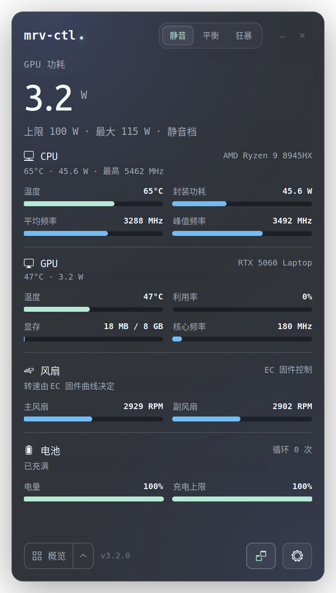
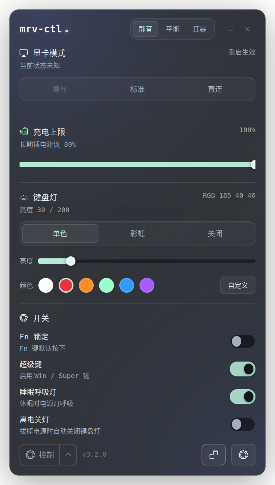
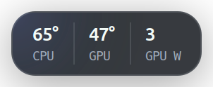

# mrv-ctl — 机械革命 Linux 控制台（40/50 系游戏本 v3）

**v3 新增（三期）**：
- **GUI 图形界面**（`mrv-gui`，GTK3 深色主题，对标 L-Mechrevo）：性能模式三键、显卡模式三选（集显/标准/直连，重启生效）、电池限充滑条（含循环次数）、键盘灯（单色/流畅彩虹/颜色选择器）、更多开关（FnLock/超级键/睡眠呼吸/离电自动关灯）、托盘常驻、可拖动悬浮窗（温度/功耗/转速）
- **deb 包一键安装**（`mrv-ctl_3.0.0_all.deb`）：`sudo dpkg -i mrv-ctl_*.deb` 后自动完成模块加载、开机自载配置、守护进程启用、nvidia-powerd 修复（unit + D-Bus policy）、桌面入口与自启动——新机安装即用
- **40/50 系多机型兼容层**：mrvd 启动时自动探测机型能力（性能模式/限充/风扇/RGB/彩虹/呼吸/FnLock/超级键/Mux），UI 按能力自适应渲染，不支持的区块自动隐藏
- **动态灯效**：流畅彩虹（固件动画）、单色（颜色选择器取色）、离电自动关灯（插电恢复）

构建 deb：`bash build-deb.sh` → `dist/mrv-ctl_<版本>_all.deb`；安装：`sudo ./install.sh`（构建并安装 deb，唯一安装路径）

> 本机不再需要 TUXEDO Control Center / tuxedo-drivers：它们在本机风扇 API 不可用，且会与 mrvd 互相覆盖 CPU 策略和性能档。所需接口全部由内核自带的 `uniwill_laptop` 提供。


Ubuntu 24.04 下对标 Windows 版控制台（L-Mechrevo / NvpwrControl）的开源控制台。
在机械革命苍龙系列（Ryzen 9 8945HX + RTX 5060 Laptop，Uniwill 准系统）上开发与验证。

## 功能与验证状态

| 功能 | 状态 | 说明 |
|---|---|---|
| GPU 功耗解锁（50W→115W） | ✅ 一期 | nvidia-powerd（NVPCF/Dynamic Boost），install.sh 自动修复 Ubuntu 打包缺失的 unit 与 D-Bus policy |
| 性能模式 office/balanced/boost | ✅ 一期 | EC 0x0751 位操作（acpi_call → `_SB.INOU.ECRW`），写后读回，开机恢复 |
| 风扇曲线 | ❌ 暂不可用（专项进行中） | 本机 hwmon `pwm1/pwm2` 为只读，用户态引擎写不进去，3.1.1 起自动停用并如实上报。EC `0x078E` bit6=1，自定义风扇表路线可行，见重构计划第六节 |
| 超温兜底 | ⚠️ 仅监控 | 风扇不可由软件控制时只记录告警，热保护由 EC 固件负责 |
| 键盘背光 + RGB 颜色 | ✅ 二期 | multicolor LED，亮度 0-200 + RGB 各通道 0-200 |
| 电池限充 | ✅ 一期 | EC 0x07B9 |
| 独显直连 Mux | ✅ 二期（实验） | DSDT IGPS/DGPS：查询可用；标准/直连切换已实现但需重启，未在压力下验证；集显模式未实现 |
| 风扇曲线 EC 侧 16 点表 | ❌ 评估后放弃 | 0x0F00-0x0F5F 需私有 WMI 命令端口写时序，读已破译写未完全破译；用户态曲线引擎已等效覆盖 |
| 超上限 TGP（120-140W） | ⚠️ 评估结论 | CTGP/DB 偏移寄存器（0x0744/0x0746）可写但 NVML 上限稳定 115W OEM 值；与 NvpwrControl "experimental" 定位一致，遗留研究 |

## 安装 / 使用

```bash
sudo ./install.sh

mrvctl status                     # 整机状态
mrvctl profile boost              # 狂暴
mrvctl fan curve "40:50,55:90,65:130,75:170,85:200"   # 风扇曲线
mrvctl fan auto                   # 交还 EC 固件曲线
mrvctl kbd color 0 120 200        # RGB 蓝
mrvctl kbd 150                    # 亮度
mrvctl charge 80                  # 限充
mrvctl mux query                  # 独显直连状态
```

## 架构

```text
mrvctl (CLI, 免 root)
   └─ /run/mrvd/mrvd.sock
        └─ mrvd (root 守护进程)
             ├─ EC 写入仲裁: 白名单 + 基线 + 写后读回
             ├─ 性能模式 / 限充: EC 0x0751 / 0x07B9
             ├─ 风扇引擎: 曲线插值 + 缓降 + 超温兜底 (单线程防打架)
             ├─ RGB: multicolor LED sysfs
             ├─ Mux: DSDT IGPS/DGPS (acpi_call)
             └─ 硬件层: acpi_call + uniwill_laptop(force=1) + nvidia-powerd
```

## 安全设计

1. EC 写白名单（0x0751/0x07B9/0x0741），未知地址拒绝。
2. 基线保存 + 位级读回验证。
3. `/proc/acpi/call` 串行化（线程锁 + `/run/mrvd/acpi_call.lock` flock），外部脚本也须持同一把锁。
4. IPC 鉴权（SO_PEERCRED）：读状态任何人；写操作需 root 或 sudo/admin/wheel/mrv 组成员。
5. INOU sysfs 开关白名单（fn_lock / super_key_enable / breathing_in_suspend / touchpad_toggle_enable）。
6. Mux 切换命令需 `--yes` 显式确认。
7. GUI 以普通用户运行，不截屏、不写 `/tmp`。

## 二期勘察结论（供后续开发参考）

1. **Uniwill EC 访问双通道**：MMIO（`_SB.INOU.ECRR/ECRW`，0xFED50000，仅覆盖 0x0-0xFFF 低页）与 WMI 命令端口（`_SB.AMW0.WMBC`→OEMG→RKBC/WKBC→EC0 CMDL/HDAT/LDAT 0x8A-0x8E，全空间）。OEMG 命令字 0x0000=写/0x0100=读/0x0200=SCMD/0x0300=IGPS/DGPS/0x0400=TjMax/0x0500=CTAF/PMSF。
2. **0x07A5** 含 FAN_QUIET(bit2)/OVERBOOST(bit4)/HIGH_POWER(bit7) 风扇模式位；**0x07A6** 是 OVERBOOST_DYN_TEMP_OFF/充电 profile 辅助位（勿再误当模式主寄存器）。
3. CTGP/DB 体系：0x0743 CTRL（GENERAL|DB|CTGP enable）、0x0744 CTGP offset、0x0745 TPP offset（0xFF=不限）、0x0746 DB offset（25W）。写入被 EC 接受但 NVML limit 不突破 115W——被 NVPCF 协商压制。
4. 主线 uniwill-acpi.c 的 regmap 后端同样走 ECRW/ECRR（max_register=0xFFF），与 MMIO 通道同范围。
5. `systemctl restart dbus` 会杀图形会话；改 D-Bus 配置用 `systemctl kill -s HUP dbus`。

## 一期遗留 → 二期状态

- ~~风扇曲线~~ ✅ 已以用户态引擎实现
- ~~RGB 灯效~~ ✅ 基础色/亮度（动态灯效可后续加）
- ~~Mux 切换~~ ✅ 命令实现（切换需重启，实测风险自担）
- 超上限 TGP：遗留研究（需 EC/NVPCF 联合调参，暂无安全路径）
- acpi_call 替换为自研内核模块：待做（当前通道稳定，优先级降低）

## v3.2.0 变更（2026-09-25，GUI 重做）

界面按 [token-monitor](https://github.com/Javis603/token-monitor) 的设计语言重做：

- 一整块无边框石墨玻璃面板（14px 圆角 + 阴影），内容直接铺在面板上，分区之间只用 1px 细线分隔，不再堆叠卡片
- 标题栏：`mrv-ctl` + 守护进程在线指示点（每次刷新脉冲），右侧胶囊分段标签切换性能档（静音 / 平衡 / 狂暴）
- 概览：GPU 功耗大号数字（数值滚动动画）+ CPU / GPU / 风扇 / 电池四个分区，每项"标签 / 数值 + 6px 细进度条"，温度按阈值变黄 / 变红
- 控制：显卡模式（内联二次确认，不弹对话框）、充电上限、键盘灯（灯效分段 + 亮度 + 预设色块）、iOS 风格开关
- 底栏：视图切换器（概览 / 控制）+ 悬浮窗 / 设置图标按钮，菜单向上弹出
- 悬浮窗改为 17px 圆角胶囊（CPU 温度 / GPU 温度 / GPU 功耗），修复黑色方角；拖动、双击开关主窗口、右键菜单
- 窗口位置、当前视图、置顶、悬浮窗状态保存在 `~/.config/mrv-ctl/gui.json`
- 守护进程 `features` 新增 `cpu_model` / `gpu_name` / `cpu_max_mhz`

| 概览 | 控制 |
|---|---|
|  |  |

悬浮窗：

## v3.1.1 变更（2026-09-25，重构阶段 0：止血）

- 修复：GUI 灯效下拉（单色/彩虹/关闭）不生效（守护进程丢弃了 effect 参数）
- 修复：`/proc/acpi/call` 多线程并发无锁，可能读到其他线程的结果
- 修复：风扇曲线 / 超温满速写只读 PWM 却报告成功；现在按能力停用并上报 `fan_mode: unsupported`
- 修复：档位切换后物理键轮询再次触发联动（执行两遍）
- 修复：状态文件并发读改写丢更新；限充读失败误显示 100%；`mrvctl status` 空值崩溃
- 安全：IPC 鉴权；INOU 开关白名单（原先可写该目录下任意 sysfs 属性）；GUI 去掉整屏截图写 `/tmp`
- 性能：IPC 每连接一个线程；独显休眠时不调用 nvidia-smi；功耗上限查询缓存 60 秒
- GUI：删除重复的"离电自动关灯"开关；集显按钮禁用；无托盘时关窗即退出
- 打包：`install.sh` 改为构建并安装 deb；升级时清理旧手工安装残留；图标打入包内；`mrvd.service` 去掉空的 ExecStopPost 和静默不启动的 Condition
- 新增：`scripts/probe-readonly.sh` 只读探测 EC 能力位与自定义风扇表（结果见 `docs/probe/`）

## v3.1 变更（2026-09-25）

**UI 重做（视觉对标 token-monitor 实机渲染）**（以下截屏毛玻璃方案已在 3.1.1 移除，界面已在 3.2.0 重做）：
- **真·毛玻璃**：窗口 RGBA 透明 + 启动时抓取桌面高斯模糊（26px）作为动态背景图，
  透过窗口可见背后桌面内容（`/tmp/mrv-gui-bg.png`）
- **实时监控卡片**：CPU 频率（均值/峰值，`scaling_cur_freq`）、CPU 封装功耗
  （RAPL `energy_uj` 差分）、GPU 频率/显存占用/利用率（nvidia-smi）
- **30px 超大号数值**作为视觉焦点（GPU 功耗），小号灰标签
- **胶囊分段控件**（选中态白底深字，同 token-monitor 的 DAY/MONTH/TOTAL）
- **Pango 字间距**（GTK3 CSS 不支持 letter-spacing，改用 Pango attr）
- 半透明玻璃卡片 + 细描边 + 柔和阴影、暗色凹陷滑条、薄荷绿开关
- 预览图：`assets/ui-preview.png`

- 深色玻璃拟态卡片（`rgba(48,52,56,0.55)` + 1px 浅描边 + 14px 圆角）
- 薄荷绿强调色 `#b7ead4`（选中态/滑条/开关）、蓝色 `#73bdf5`（数值）
- 全等宽字体（monospace），紧凑间距，图标化底栏（退出/设置/悬浮窗）
- 修复：按钮状态同步误触回写 EC 的 bug（抑制标志）、深色主题、窗口尺寸自适应

**性能档位联动（新增）**：
- 档位 → CPU 能效偏好（amd-pstate EPP：power/balance_performance/performance）
- 档位 → 风扇曲线 + 键盘灯亮度/彩虹
- **物理性能键检测**：固件自行切换 EC 档位而不通知 Linux，mrvd 轮询感知并自动应用联动

## 实测结论：GPU 功耗墙（重要）

| 验证 | 结果 |
|---|---|
| 三档切换后 NVML | office/balanced/boost 全为 100W(current) / 115W(max) |
| 负载下实际功耗 | office 14.21W vs boost 13.84W（无差异，glmark2+NVIDIA 渲染） |
| CTGP 偏移（EC 0x0744+0x0743） | 13.19 / 13.11 / 13.63W（噪声级，无效） |
| `nvidia-smi -pl` | 驱动拒绝（笔记本封死） |
| nvidia-powerd 重启重协商 | 无变化 |

**结论**：Linux 下 GPU 功耗墙由 `nvidia-powerd`（NVPCF）固定协商，EC 档位无法改变。
Windows 版能改是因为其控制台**直接改 NVIDIA 驱动内部运行时对象**（即 NvpwrControl 项目做法），
Linux 无此通道。**115W（OEM 上限）是 Linux 可达到的最优值**（修复前为 50W）。
档位切换的实际作用域：CPU 能效策略 + 风扇曲线 + 灯效 + EC 内部功耗预算。

## 风扇控制状态

- 系统内核 `uniwill_laptop` 驱动：提供温度/转速**只读** hwmon（无 write 回调，pwm 只读）
- 已额外编译安装 tuxedo 三件套（DKMS `tuxedo-mrv`，白名单已 patch 允许 MECHREVO）：
  `/dev/tuxedo_io` 可用，`uniwill_wmi` 提供 WMI 命令端口全空间 EC 读写
- 但 `W_UW_FANSPEED` 写入未生效（tuxedo 对未知机型 barebone ID 的特性 gating +
  0x0Fxx 自定义表使能序列），风扇曲线暂不可用，属跨机型适配遗留项
- 保留：温度/转速监控 + 超温兜底逻辑
